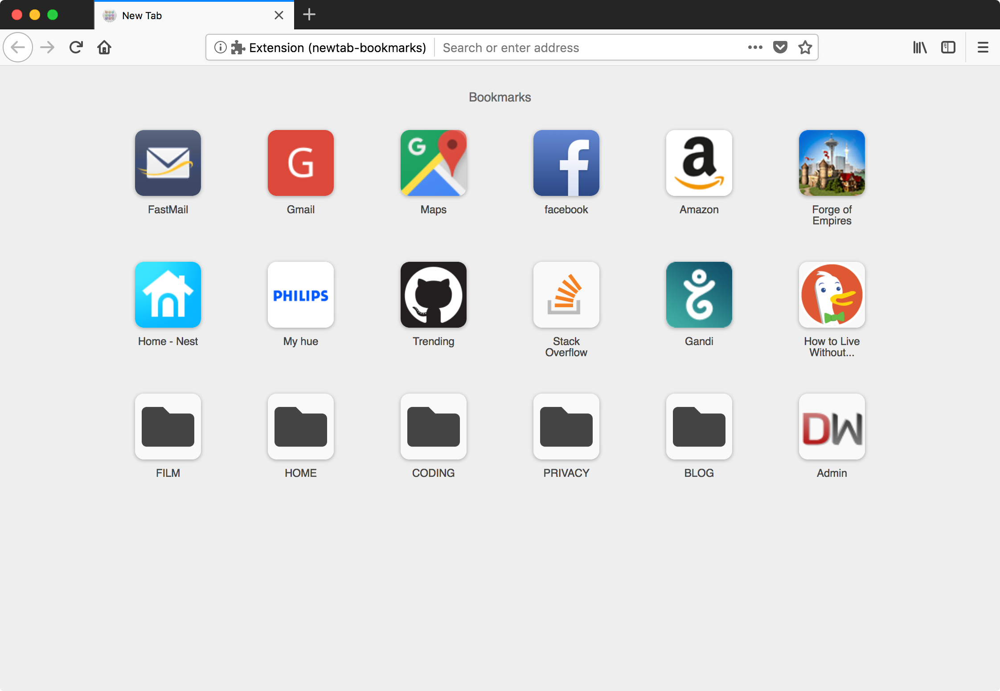

# Perfect Home
Replace your new-tab page and home page with your bookmarks.
No ads, no speed dials, no frequently visited or other "frecence" bullshit!
Just your own, predictable grid of links.



# Usage
- Select a folder from your bookmarks
- Enjoy!


# TODO
- [ ] breadcrumbs in header
- [ ] improve styling
- [ ] custom images for tiles
- [ ] drag & drop to reorder
- [ ] command palette (filter flat list)
- [ ] shortcuts (1-9?)
- [ ] accessibility


# Build locally
1. `npm i`
2. To test the extension in a temporary firefox profile, use the test script:
    ```sh
    npm start
    ```
3. To build a zip artifact (that can be uploaded to mozilla addons):
    ```sh
    npm run ext-build
    ```
