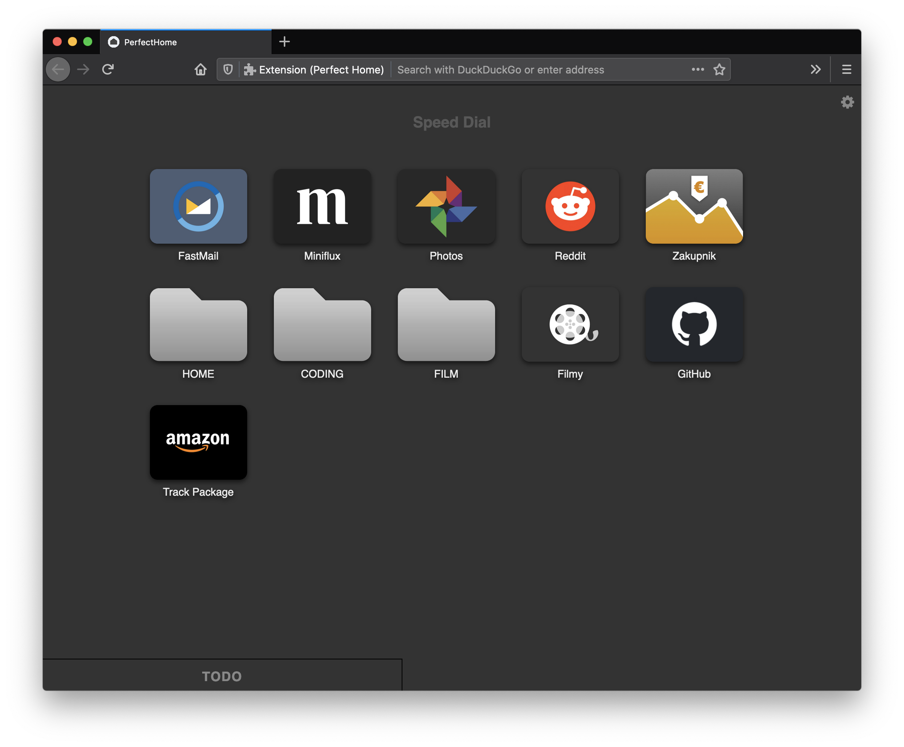

# Perfect Home
Replace your new-tab page and home page with your bookmarks.
No ads, no speed dials, no frequently visited or other "frecence" bullshit!
Just your own, predictable grid of links.

## First pre-release available for testing!
- Download from [mozilla addons page](https://addons.mozilla.org/en-US/firefox/addon/perfect-home/)
- Enjoy :smile:




## FEATURES
- [x] Drag & drop tiles to reorder
- [x] Command palette (filter flat list) (currently Cmd+P on mac - when focus is on page)
- [x] Use custom images for tiles (right-click on a tile -> custom thumbnail)
- [x] Style page with custom css - paste your css in settings
- [x] Requires only 2 permissions: bookmarks & storage (to save settings & cache thumbnails)!
- [x] Settings export/import
- [x] docked folders
- [x] context-menu: clear thumb
- [x] change icons for bookmarks in docked folders


## TODO
- [ ] drag & drop between docked folders
- [ ] favicons:
  - [ ] fallback: if better quality exists - replace the crap from google's service
  - [ ] cache url (or icon?)
- [ ] Testing:
  - [ ] https://github.com/pngwn/svelte-test
  - [ ] https://github.com/testing-library/svelte-testing-library
  - [ ] https://github.com/rspieker/jest-transform-svelte
  - [ ] https://github.com/ktsn/svelte-jest
- [ ] light/dark themes (css based on the OS?)
- [ ] accessibility (keyboard support)

<!--
	Docked Folder
	There would be max 3 different docks: left, right, bottom; with options:
	- folder ID
	- view mode: list (column grid) | icons (row grid)
	- size: distance from the edge (height | width), depending on the clip side
	- background?
	- hide when empty?
	- align items:
	- on left|right: top | middle | bottom
	- on bottom one: left | center | right
-->


## Usage
- Select a folder from your bookmarks
- Enjoy!


## Build locally
1. `npm i`
2. To test the extension in a temporary firefox profile, use the test script:
    ```sh
    npm start
    ```
3. To build a zip artifact (that can be uploaded to mozilla addons):
    ```sh
    npm run ext-build
    ```
