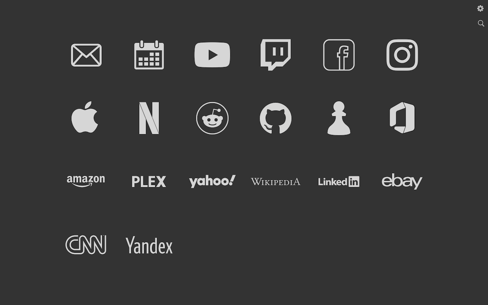

> [!IMPORTANT]
> **UPDATE March 2026:** Unfortunately the extension is no longer available in Mozilla's Addons store.
>
> I recently received an email from them, saying that this extension was reported that it's not possible to build it from source.
> And that I need fix this or they will remove it from their store.
> 
> I tweaked the scripts to make them idiot-proof, updated the Readme doc, and pushed a new version, but unfortunately it was not enough for them.
> I've got the same email saying that they can't build it (with the same log attached, where some automated process tries to run scripts that don't exist). 
> No idea why. No idea what else I can do. I have no more capacity to keep trying to satisfy mozilla's extension "experts".
> 
> Feel free to fork & publish.

----


# Perfect Home

Replace your new-tab page and home page with your bookmarks.
No ads, no speed dials, no frequently visited or other "frecence" bullshit!
Just your own, predictable grid of links.

**Download from [chrome web store](https://chrome.google.com/webstore/detail/hdekbnedodfockfppllkaaahaibfgcaj)**

**Download from ~~[mozilla addons page](https://addons.mozilla.org/firefox/addon/perfect-home/)~~** *

**[](https://addons.mozilla.org/firefox/addon/perfect-home/)**

## FEATURES
- [x] Drag & drop tiles to reorder
- [x] Command palette (filter flat list) (currently Cmd+P on mac - when focus is on page)
- [x] Custom images for tiles (right-click on a tile -> edit, or just drag an image from desktop and drop it on a thumbnail)
- [x] Style page with custom css - paste your css in settings
- [x] Requires only 1 permissions (bookmarks)!
- [x] Theme support! :tada:
- [x] Settings export/import
- [x] Docked Folders


## Usage
- Select a folder from your bookmarks
- Enjoy!


## Privacy
This extension only needs 1 permission from Firefox - to access your bookmarks.
You can also allow this extension to send requests to 3rd party services:
- Google Favicon service - to display nice favicons in Docked Folders and in the Search panel
- Github API - to be able to use the Themes

If you do NOT allow either of these - the extension will still work without any issues. You just won't see the favicons or won't be able to use themes directly from the extension (you can still manually download theme icons & copy & paste the css).

You can change these options in the extension settings, in the **Privacy** section


## Themes
More on how to use Themes in the [PerfectHome Themes](https://github.com/perfect-things/perfect-home-themes#perfect-home---themes) repository.


## Customization
See [a tutorial here](customization-tutorial.md)


## Build locally

### Firefox / Mozilla Add-ons build

Install the exact dependency versions from the lockfile:

```sh
npm ci
```

Build the production Firefox extension:

```sh
npm run build:amo
```

The unpacked Firefox extension is generated in:

```text
amo-dist/
```

The uploadable ZIP is generated in:

```text
web-ext-artifacts/
```

Mozilla's default reviewer build environment is:

* Ubuntu 24.04.4 LTS
* ARM64
* Node.js 24.14.0
* npm 11.9.0

### Development

To test the extension in a temporary Firefox profile:

```sh
npm start
```

## Creating test-profile in Firefox
1. Open `about:profiles`
2. Create `test-profile`
3. Set your previous profile as "default" again


## Buy me a coffee :smile:
<a href="https://www.buymeacoffee.com/tborychowski" target="_blank"></a>
